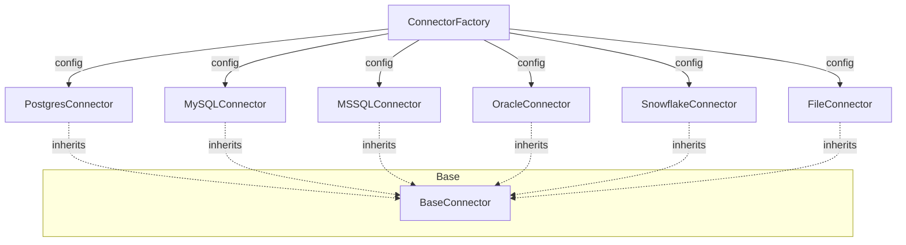

# CONNECTOR RUNTIME FLOW MAP

## 1. Connector Abstraction Hierarchy

## 2. Interaction Lifecycle

### A. Initialization
1. `ConnectionManager` receives request.
2. `ConnectorFactory.get_connector(config)` is called.
3. Factory checks `_instance_cache` for existing connector with matching ID/Signature.
4. If not found, instantiates the specific connector class.
5. Connector `__init__` sets up configuration (timeout, pool size, etc.).

### B. Connection & Pool Management
1. `connector.connect()` is called (lazy or explicit).
2. Connector uses `_connect_lock` (inherited from `BaseConnector`) to prevent race conditions during pool creation.
3. Driver-specific pool is initialized (e.g., `asyncpg.create_pool`, `aioodbc.create_pool`).

### C. Execution (Testing / Discovery / Querying)
1. `test_connection()`: Performs a single connection attempt + version query.
2. `get_schemas()`: Discovers available databases/schemas.
3. `get_tables(schema)`: Discovers tables/views in a schema (respects `metadata_limit`).
4. `stream_query(query, params)`: Returns an `AsyncGenerator` yielding dicts.

### D. Termination
1. `connector.disconnect()` is called.
2. Driver-specific pool is closed and resources released.
3. `ConnectorFactory.remove(id)` evicts the instance from cache.

## 3. Connector Matrix

| Connector | Driver | Async Support | SSL Support | Metadata discovery |
|-----------|--------|---------------|-------------|-------------------|
| Postgres  | asyncpg| Native        | Full        | information_schema|
| MySQL     | aiomysql| Native       | Native      | information_schema|
| MSSQL     | aioodbc | via ODBC 18   | Native      | information_schema|
| Oracle    | oracledb| Native (Thin) | Full        | ALL_TABLES        |
| Snowflake | snowflake-connector| Wrapper | Native | SHOW TABLES       |
| File      | DuckDB  | Native       | N/A         | Internal Schema   |
