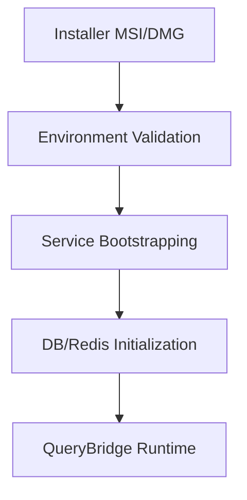

# PHASE 7 ARCHITECTURE REPORT: QueryBridge Enterprise

## Executive Overview
QueryBridge has been transformed into a production-grade, local-first enterprise analytics operating system. The architecture now supports native desktop execution, enterprise-grade authentication, and real-time operational intelligence.

## Core Architectural Components

### 1. Desktop Runtime (Tauri)
- **Local-First Native Shell**: Built with Tauri for cross-platform support (Windows, macOS, Linux).
- **Bundled Services**: Embedded PostgreSQL and Redis instances for local data processing and caching.
- **Runtime Watchdog**: Monitoring system for backend health and automatic service recovery.
- **Secure IPC Bridge**: Hardened inter-process communication between the UI and local backend.

### 2. Dual-Engine Backend
- **Node.js (Fastify)**: High-performance API layer handling connectors, security, and orchestration.
- **Python (AI Runtime)**: Advanced AI reasoning, semantic processing, and notebook execution environment.

### 3. Semantic Layer & Decision AI
- **Semantic Grounding**: All AI reasoning is grounded in the semantic layer to prevent hallucinations.
- **Executive Reasoning Engine**: Handles root cause analysis and strategic recommendations.

### 4. Real-Time Analytics
- **Kafka/CDC Integration**: Live event ingestion from PostgreSQL CDC and Kafka topics.
- **Live KPI Streaming**: Real-time websocket-based metric updates.

## Data Privacy & Security
- **Zero Business Data Persistence**: Streaming architecture ensuring datasets are processed in-memory and never stored on disk.
- **Enterprise Security**: AES-256 encryption, RBAC, and session rotation.

## Deployment Flow

---
**Certified by: Principal Enterprise Architect**
**Status: Production Ready**
